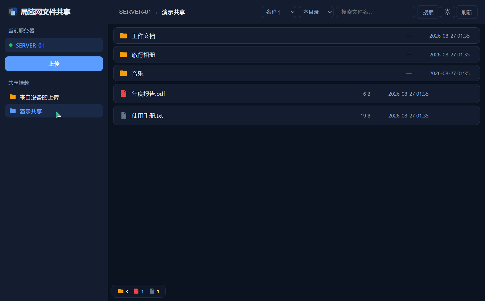
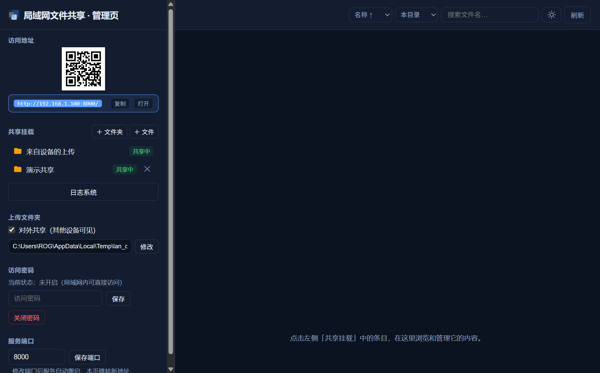

# 局域网文件共享（LAN File Share）

零依赖配置的 Windows 局域网文件共享工具：双击运行，自动创建系统托盘与本地网页服务，局域网内手机/电脑直接浏览器访问，上传下载文件与文件夹，无需安装任何客户端。

用户端（手机 / 电脑浏览器直接访问）：



管理端（共享管理 / 上传设置 / 日志仪表板）：



## 功能

- **即开即用**：单个 exe（或 `python main.py`）启动，系统托盘常驻，局域网设备扫码/输地址即访
- **共享管理**：任意本地文件夹或单个文件挂载为共享；支持取消共享（排除）、暂时隐藏（用户端不可见、随时恢复）
- **上传**：手机/电脑可向服务端上传文件与**整个文件夹**（保留目录结构，同名自动重命名，实时进度）；上传内容存入独立的 uploads 文件夹并固定置顶，可开关是否对外共享
- **浏览**：目录/文件彩色图标、面包屑导航、浏览器侧键（前进/后退）支持、搜索（本目录/本共享/全部共享三种范围）、多种排序
- **预览**：图片、视频（支持拖动进度条）、音频、PDF、文本在线预览
- **安全**：可选访问密码（SHA-256 加盐）；管理接口仅限本机访问；路径越界防护
- **日志仪表板**：SQLite 记录上传/下载流水；可视化统计（文件类型占比饼图、类型大小分布柱状图、上传/下载趋势、最近记录），卡片可开关可排序
- **体验细节**：深色模式（跟随系统）、二维码扫码直达、重复启动 toast 提示、Windows 原生通知

## 运行

### 方式一：Python 直接运行

```bash
pip install -r requirements.txt
python main.py
```

### 方式二：打包为单个 exe（分发推荐）

```bash
pip install pyinstaller
python build_exe.py            # 产物：dist/局域网文件共享.exe（页面已内嵌）
python build_exe.py --console  # 带控制台窗口的调试版
```

exe 旁无需任何附加文件；首次运行自动生成 `config.json` 与 `uploads/`。

### 使用

1. 启动后托盘出现图标，浏览器打开管理页 `http://本机IP:端口/admin`（访问地址模块有二维码，手机扫码即达用户页）
2. 在「共享挂载」添加要共享的文件夹/文件
3. 局域网设备访问 `http://IP:端口` 即可浏览、下载、上传

## 配置说明

运行时在程序旁自动生成 `config.json`（格式见 [config.example.json](config.example.json)）：

| 字段 | 说明 |
|---|---|
| `port` | 服务端口（默认 8000） |
| `password_hash` | 访问密码哈希（通过管理页设置，留空 = 无密码） |
| `mounts` | 共享挂载点列表（id / name / path） |
| `upload_dir` | 设备上传文件存放目录（默认程序旁 `uploads/`） |
| `auto_share_uploads` | 上传内容是否对外共享（关闭则仅服务端可见） |
| `dashboard.cards` | 仪表板卡片开关与排序（管理页内直接调整即可） |

## 测试

```bash
pip install pytest
pytest tests/ -q
```

## 项目结构

```
main.py            # 入口：单实例互斥、托盘、启动服务
server.py          # Flask 应用与 AppState
api_user.py        # 用户端接口（浏览/下载/预览/搜索/鉴权）
api_admin.py       # 管理端接口（仅本机，挂载/配置/二维码/状态）
api_upload.py      # 上传接口（文件与文件夹）
mounts.py          # 挂载注册表（含排除/隐藏/系统挂载置顶）
config.py          # 配置读写
auth.py            # 密码哈希与访问令牌
network.py         # 局域网 IP 探测
transfer_log.py    # SQLite 传输日志
tray.py            # 托盘图标/菜单/Windows 通知（AUMID 注册）
build_exe.py       # 一键打包脚本
pages/             # 前端页面（browse.html 用户端 / admin.html 管理端）
tests/             # pytest 测试
```

## 许可证

[MIT](LICENSE)
